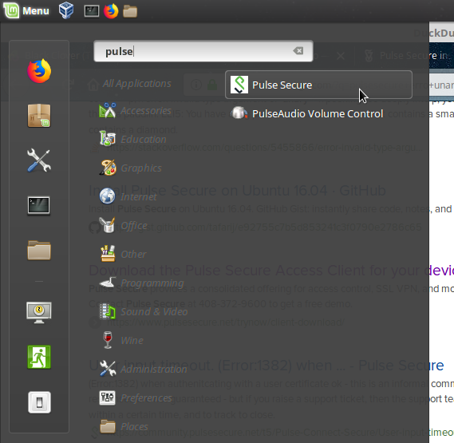
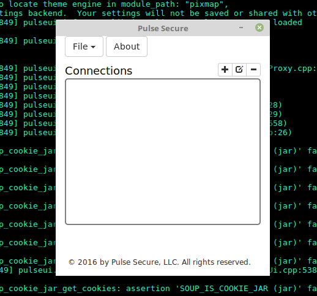

## How to install pulse secure on mint 18
(new NTU vpn)

I have googled online and kept seeing that the newer version of mints are not supported... Hence, I try my best to fix it and this is how I did it.

My Mint version is the following:

```sh
$ cat /etc/issue
Linux Mint 18.3 Sylvia \n \l
```


## Original pdf

NTU provided a [pdf](./VPNClient-Linux.pdf)

We will download the file and install it.

```sh
$ wget http://www3.ntu.edu.sg/cits2/ras/for_cms_ref/VPN-Linux-Debian.zip -O VPN-Linux-Debian.deb
$ sudo dpkg -i VPN-Linux-Debian.deb
```

Don't worry about the error message `[: 0: unary operator expected ...`, it is actually considered installed.

To fix the error message, overwrite the single square bracket `[ conditionhere ]` with double square brackets `[[ conditionhere ]]` and you won't see such error anymore.



By searching for "pulse", you can see that the icon is there.

So why does it fail to launch?

## Dependency

I added the icon to my Desktop.
From the icon on my Desktop, I can view property of it to see that actual command the icon will trigger.

The following is the actual command:

`/usr/bin/env LD_LIBRARY_PATH=/usr/local/pulse:$LD_LIBRARY_PATH /usr/local/pulse/pulseUi`

When I ran that command, I saw that it needed `libwebkitgtk-1.0.so`

```sh
$ file pulseUi
pulseUi: ELF 32-bit LSB executable, Intel 80386, version 1 (SYSV), dynamically linked, interpreter /lib/ld-linux.so.2, for GNU/Linux 2.6.18, BuildID[sha1]=d41784eb7d9774edab2cb618f9e7f1aa6d81df54, not stripped
```

The application uses 32 bit instead of 64 bit.

```sh
sudo apt update
sudo apt install libwebkitgtk-1.0:i386
```

## Success

Here is the GUI!


