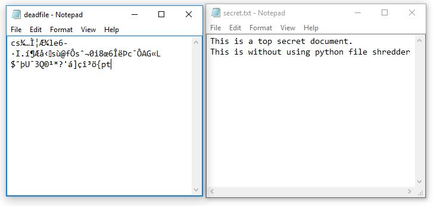

# Utils
This is the section where I coded scripts that can be used every other day

|script|description|
|------|-----------|
|checkHash.py|file integrity checker using md5/sha1/sha256|
|shredder.py|overwrite with random data and unlink a file |
